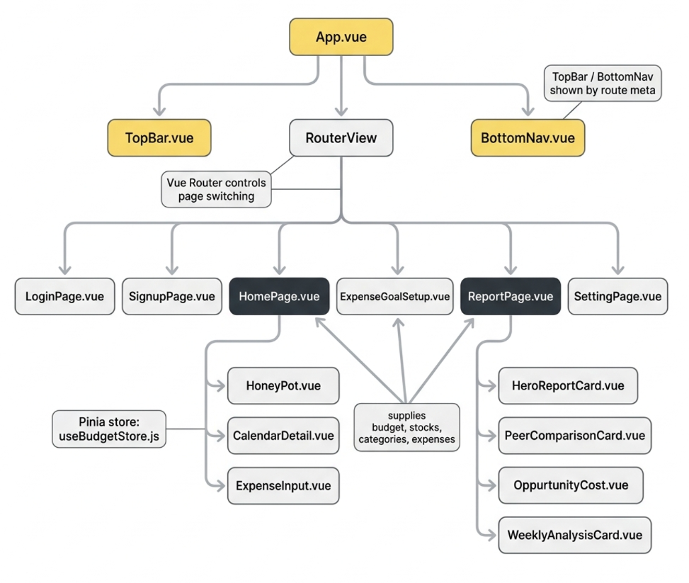
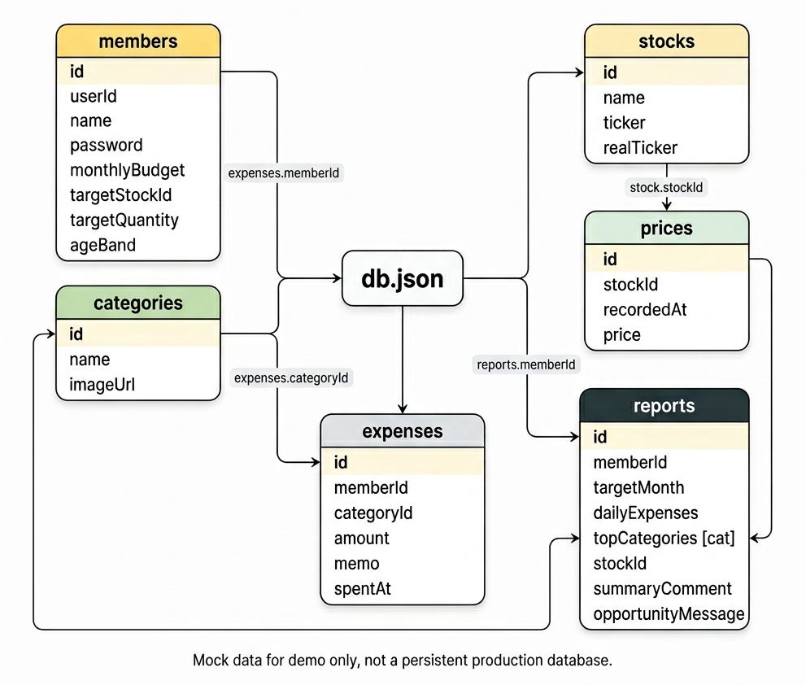

# 내 주식 어디갔어?

23회차 2조 주식 연계 소비관리 서비스입니다.

**내 주식 어디갔어?**는 생활비를 기록하고 남은 예산을 목표 주식 기준으로 환산해 보여주는 서비스입니다. 단순히 “얼마를 썼는지”를 남기는 데서 끝나지 않고, 오늘의 소비가 투자 관점에서 어떤 의미였는지 체감할 수 있도록 설계했습니다.

## 배포 링크

- 공유용 주소: http://내주식어디갔어.kro.kr
- Vercel 직접 주소: https://skeleton-project-tau.vercel.app

공유용 주소는 웹 포워딩 방식으로 Vercel 배포 주소에 연결되어 있습니다. 접속 후 주소창이 Vercel 주소로 바뀔 수 있습니다.

## 시연 GIF


## 테스트 계정

| 유형 | ID | PW | 설명 |
| --- | --- | --- | --- |
| 계획형 사용자 | `ming0409` | `qwer1234!` | 생활비를 기준으로 꾸준히 소비를 관리하며 목표 주식을 모아가는 사용자 |
| 소비 관리가 부족한 사용자 | `jinsh` | `abcd1234!` | 예산 초과 지출이나 무리한 목표 설정 검증을 확인하기 좋은 사용자 |

## 주요 기능

- 이번 달 남은 생활비 확인
- 생활비 사용 비율 시각화
- 오늘의 소비를 목표 주식 기준으로 환산
- 캘린더 기반 지출 확인
- 리포트를 통한 소비 패턴 분석
- 예산 초과 지출 및 비현실적 목표 입력 방지

## 현재 버전 안내

현재 배포 버전은 목업 데이터 기반 시연 버전입니다.

실시간 주식 시세 API와 영구 저장 기능은 API Key 노출 및 운영 안정성 이슈를 고려해 프론트 배포 범위에서는 제외했습니다. 추후 백엔드 서버와 연동해 실시간 시세, 인증/인가, 영구 저장 기능을 확장할 예정입니다.

Vercel 배포 버전의 mock API는 시연 중 사용자 입력 흐름을 확인하기 위해 임시 데이터를 다룹니다. 함수 인스턴스가 재시작되거나 재배포되면 입력한 데이터가 초기화될 수 있습니다.

## 기술 스택

- Vue 3
- Vite
- Pinia
- Vue Router
- Tailwind CSS
- FullCalendar
- ApexCharts / Chart.js
- Axios / Fetch API
- json-server
- Vercel Functions mock API

## 로컬 실행

```bash
npm install
npm run dev
```

로컬 개발 환경에서는 Vite와 json-server가 함께 실행됩니다.

```text
Frontend: http://localhost:5173
Mock API: http://localhost:3000
```

빌드 및 검증 명령어:

```bash
npm run build
npm run test:unit
npm run validate:db
```

## 프로젝트 구조

```text
src/
  App.vue
  main.js
  router/
    index.js
  stores/
    useBudgetStore.js
  utils/
    budgetValidation.js
    budgetValidation.test.js
  components/
    TopBar.vue
    BottomNav.vue
    HoneyPot.vue
    CalendarDetail.vue
    ExpenseInput.vue
  pages/
    loginPage/
      LoginPage.vue
    signupPage/
      SignupPage.vue
    homePage/
      HomePage.vue
    Setup/
      ExpenseGoalSetup.vue
    reportPage/
      ReportPage.vue
      components/
        HeroReportCard.vue
        PeerComparisonCard.vue
        OppurtunityCost.vue
        WeeklyAnalysisCard.vue
    settingPage/
      SettingPage.vue
```

## 컴포넌트 트리



```text
App
├─ TopBar
├─ RouterView
│  ├─ LoginPage
│  ├─ SignupPage
│  ├─ HomePage
│  │  ├─ HoneyPot
│  │  ├─ CalendarDetail
│  │  └─ ExpenseInput
│  ├─ ExpenseGoalSetup
│  ├─ ReportPage
│  │  ├─ HeroReportCard
│  │  ├─ PeerComparisonCard
│  │  ├─ OppurtunityCost
│  │  └─ WeeklyAnalysisCard
│  └─ SettingPage
└─ BottomNav
```

라우터 메타 정보에 따라 `TopBar`와 `BottomNav`가 필요한 화면에만 표시됩니다.

## DB 구조

목업 데이터는 루트의 `db.json`에 저장되어 있습니다.



```text
db.json
├─ members      사용자, 예산, 목표 주식 설정
├─ categories   지출 카테고리 및 이미지 경로
├─ stocks       목표 주식 후보와 종목 코드
├─ prices       주식별 가격 스냅샷
├─ expenses     사용자별 지출 내역
└─ reports      월간 리포트, 소비 패턴, 주식 환산 결과
```

현재 데이터 수:

| key | count | 주요 필드 |
| --- | ---: | --- |
| `members` | 2 | `userId`, `name`, `password`, `monthlyBudget`, `targetStockId`, `targetQuantity`, `ageBand`, `id` |
| `categories` | 9 | `id`, `name`, `imageUrl` |
| `stocks` | 5 | `id`, `name`, `ticker`, `realTicker` |
| `prices` | 5 | `id`, `stockId`, `recordedAt`, `price` |
| `expenses` | 70 | `id`, `memberId`, `categoryId`, `amount`, `memo`, `spentAt` |
| `reports` | 2 | `id`, `memberId`, `targetMonth`, `dailyExpenses`, `topCategories`, `summaryComment`, `opportunityMessage` |

## API 메모

로컬 개발에서는 `json-server`가 `db.json`을 읽어 REST 형태로 제공합니다.

```text
GET /members
GET /stocks
GET /reports?memberId=2
POST /expenses
PATCH /members/:id
```

Vercel 배포 브랜치인 `deploy/vercel`에서는 json-server를 실행하지 않고, Vercel Functions 기반 mock API로 같은 목업 데이터를 응답합니다. 이 API는 시연용이며 영구 저장을 보장하지 않습니다.

## 브랜치 메모

- `main`: 기본 개발 브랜치
- `deploy/vercel`: Vercel 배포용 브랜치
- 문서/기능 작업은 목적에 맞는 별도 브랜치를 만든 뒤 PR로 병합합니다.

## 커밋 컨벤션

커밋 메시지는 아래 형식을 권장합니다.

```text
type: summary
```

주요 type:

- `feat`: 기능 추가
- `fix`: 버그 수정
- `design`: UI/CSS 변경
- `refactor`: 리팩터링
- `docs`: 문서 변경
- `chore`: 빌드, 설정, 패키지 작업
- `test`: 테스트 추가 또는 수정

예시:

```text
feat: add expense input validation
fix: route vercel mock api queries
docs: update project readme
```
